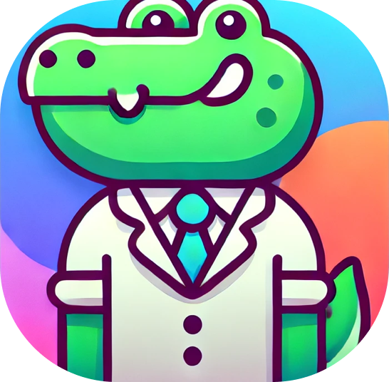

<!-- PROJECT LOGO -->
<br />
<p align="center">
  <a href="https://github.com/JackHumphries9/dapper-go">
    
  </a>

<h3 align="center">Dapper Go</h3>

  <p align="center">
      Discord Application Wrapper for Go (HTTP Only)
  </p>
</p>

<!-- TABLE OF CONTENTS -->

## Table of Contents

-   [About the Project](#about-the-project)
-   [Getting Started](#getting-started)
-   [Contributing](#contributing)
-   [Releases](#releases)
-   [License](#license)
-   [Contact](#contact)

<!-- ABOUT THE PROJECT -->

## About The Project
Dapper provides a simple and intuative API for making Discord interaction applications. It is built on top of the GLaDIs library, which provides a simple way to interact with the Discord API.

### Built With

-   [Go](https://go.dev)
-   [GLaDIs](https://github.com/TGWaffles/GLaDIs)


## Getting Started

To get a local copy up and running follow these simple steps.

Install the package in your Go project:

```sh
go get github.com/JackHumphries9/dapper-go
```

## Releases

See the [releases](https://github.com/JackHumphries9/dapper-go/releases/) page for all releases/tags.

## Contributing

Contributions are what make the open source community such an amazing place to learn, be inspired, and create. Any contributions you make are **greatly appreciated**.

1. Fork the Project
2. Create your Feature Branch (`git checkout -b feature/AmazingFeature`)
3. Commit your Changes (`git commit -m 'Add some AmazingFeature'`)
4. Push to the Branch (`git push origin feature/AmazingFeature`)
5. Open a Pull Request

## License

Distributed under the GNU General Public License v3.0 License. See `LICENSE` for more information.

## Contact

Jack Humphries - [Email](mailto:jack@jackh.club)
